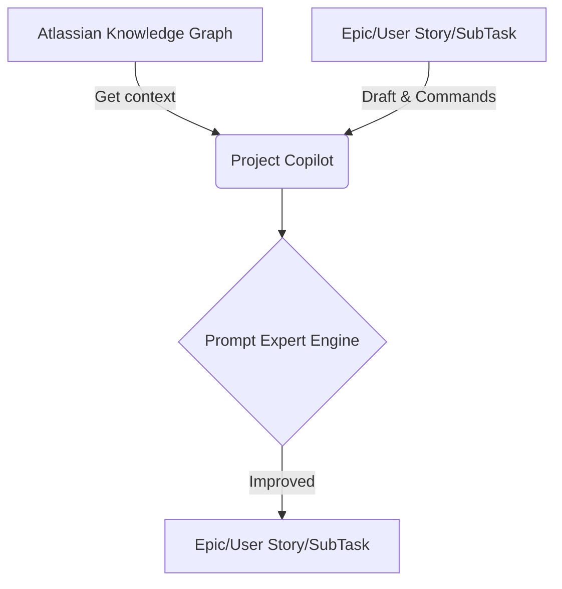

# CodeLab: Creating a Fitness App Using Project Copilot and GitHub Copilot
## Summary
This CodeLab is a brief tutorial on how to utilize Project Copilot and GitHub Copilot in a small software development project.

## Introduction to Project Copilot

### Why Project Copilot?

### ChatGPT vs Project Copilot 
- Both provides Generative AI for Epics, User Stories and Sub Tasks
    - Why is better Project Copilot?
        - You don't need to write prompts from scratch
        - You can extend the prompt expert engine with commands
        - Context based on Atlassian Knowledge Graph

### GitHub Copilot
- Generative AI for Code
    - Based on 
        - Previous code
        - Code comments
        - Chat
    - Cons
        - Deviation of code regarding requeriments for poor user stories
        - Rework because deviation

### Project Copilot and GitHub Copilot
- Generative AI for Project Planning (Epics, User Stories, Sub Tasks) and Code
    - Generate Epics, User Stories and Sub-Tasks
    - Use User Stories and Sub-Tasks for chat code generation

### Project Copilot for Semantic Validation
- Automatic semantic description for code of pull requests (PR)
- Validation of semantic description of PR regarding user stories

## CodeLab

The CodeLab provides an initial version of the project as a starting point. This version was exclusively created by a human, with the constraint of completing the project epics, user stories, sub-tasks, code, and peer reviews in a maximum of 10 hours.
The goal of the CodeLab is to gradually recreate the same project with the assistance of Project Copilot and GitHub Copilot in less than 1 hour to finally compare both projects, and get metrics about the planning and implementation.

The project's objective is to develop a compact client-side fitness application using HTML and JavaScript. This application should be capable of interfacing with the Google Fit REST API and computing daily calorie consumption based on the number of steps taken. Additionally, it should calculate a health score derived from these calories and "heart points."

