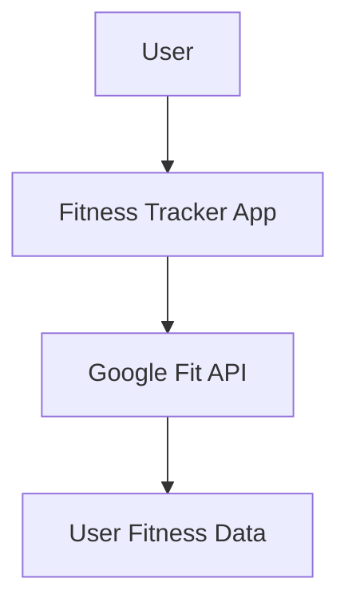
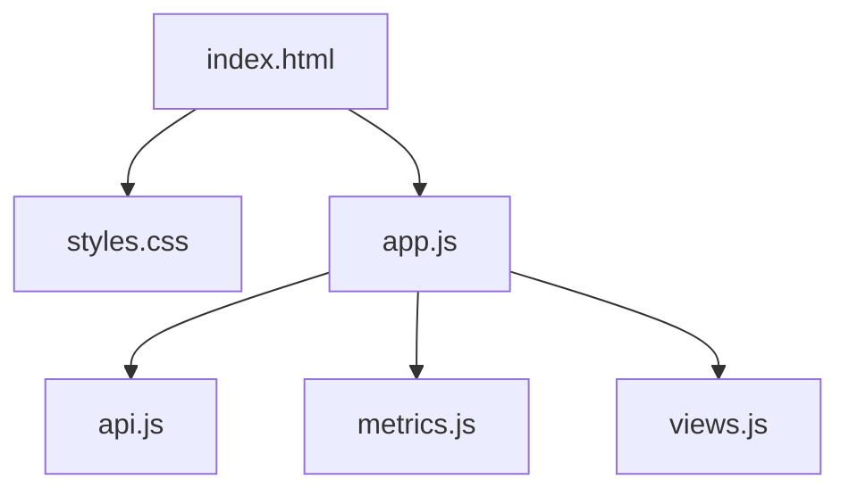

# Software Architecture Document
## Title: Software Architecture Document
### Initial content:

.

### Actions in Project Copilot:
- Write custom instruction:
```xml
<instruction>...</instruction>
```
### Final content:

#### Introduction
This project is a small HTML/JavaScript client-side app that consumes the Google Fit REST API to calculate calories and estimate health status based on parameters like calories per day and heart points.

The main goal is to implement a small project in 10 hours without AI assistant tools, and then recreate it using AI tools to generate project documents, code, and tests. This allows us to compare the time, quality, and artifacts produced with and without AI assistance.

#### Architecture Diagram



The app architecture consists of:
* **User**: Interacts with the Fitness Tracker app via the browser
* **Fitness Tracker App**: HTML/JS app running in the browser
    * Calculates health metrics based on API data
    * Displays metrics and trends to user
* **Google Fit API**: Provides user fitness data to the app
* **User Fitness Data**: User's exercise, heartbeat, sleep etc data stored in Google Fit

#### Features
The core features of the Fitness Tracker app are:
* Fetch user fitness data from Google Fit API
* Calculate calories burned per day
* Calculate average heart points per day
* Display calories burn and heart points over time
* Provide basic health recommendations based on metrics

#### Code Implementation
The app is implemented in:
* HTML5 for markup
* CSS3 for styling
* JavaScript for logic
* Google Fit REST API for user data

Key libraries used:
* Google Identity Service JavaScript library: [Using the token model  |  Authorization  |  Google for Developers](https://developers.google.com/identity/oauth2/web/guides/use-token-model)
* Chart.js for data visualizations
* Moment.js for date manipulation

The components are structured as follows:



#### Testing Strategy
Testing focuses on:
* Unit testing critical modules like metrics and API clients
* Validating UI and interactions with Selenium
* Integration testing end-to-end flows
* Performance testing with realistic datasets

#### Next Steps
Future iterations could enhance the app by:
* Adding user accounts and persistence
* Supporting more fitness data sources
* Predicting future metrics based on trends
* Gamifying goals and health outcomes
* Building mobile apps and synchronizing across devices