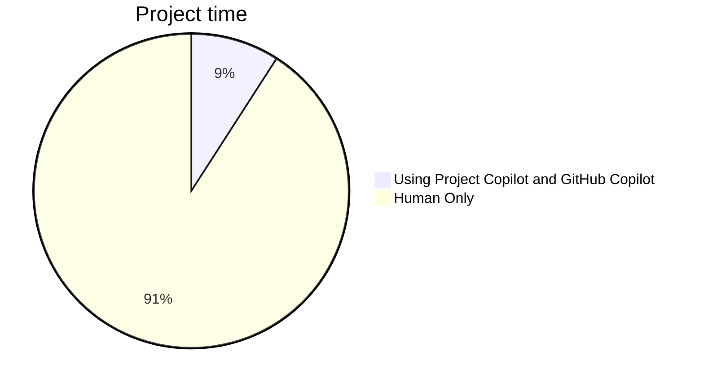

# CodeLab: Creating a Fitness App Using Project Copilot and GitHub Copilot
## Step 5: Developing a Simple Fitness App: With vs Without Project Copilot

Project Copilot is an AI assistant that helps write design and technical documents in Atlassian tools like Confluence and Jira. It can help generate high quality documentation and issues like Epics, User Stories and Sub-Tasks for software projects.

This report compares developing a simple Fitness App with  2 Epics, and 4 user stories, with and without using Project Copilot

### Developing a Simple Fitness App: Without Project Copilot

Without Copilot, the Fitness app takes 10 hours to develop. The planning and documentation is poor. There are 3 bugs in the code.

Pros:

- Developer has full control over the code ?

Cons:

- Long development time
- Poor planning and documentation
- Bugs in code that need fixing

### Developing With Project Copilot

With Copilot, the Fitness app takes only 1 hour to develop. Copilot handles planning, documentation and generates bug-free code.

Pros:

- Extremely fast development time
- High quality documentation
- No bugs in generated code

Using Project Copilot results in a 10x faster development with high quality documentation and code. 

Here is a table comparing the artifacts produced with and without using Project Copilot:

| **Artifact** | **Without Project Copilot (10 hours)** | **With Project Copilot (1 hour)** |
| -------- | ------- | ------- |
| **Epics** | 2 epics with 1-2 sentences | 2 epics with detailed descriptions |
| **User Stories** | 4 user stories with 1-2 sentences | 4 user stories with detailed descriptions |
| **Design Documents** | 0 design documents | 1 detailed design document |
| **Bugs** | 3 bugs found in testing | bug-free |

Using Project Copilot provides tremendous value to the business in several ways:

- **Faster time-to-market**: By automating documentation and code generation, Copilot allows projects to be developed 10x faster. This enables bringing products and features to market quicker, ahead of competitors.
- **Higher quality**: Copilot produces bug-free code and complete documentation. This results in products with higher reliability and maintainability.
- **Improved customer satisfaction**: Higher quality products and faster delivery of new features directly translate into happier, more satisfied customers.
- **Cost savings**: The automation and acceleration provided by Copilot significantly reduces development costs. Less developer time is required per project.
- **Competitive advantage**: The speed and quality improvements from Copilot are difficult for competitors to match without similar AI capabilities. This provides a sustained competitive edge.
- **Future proofing**: Copilot keeps development skills up-to-date with the latest techniques. This future proofs the engineering organization.

Here is a justification of the cost savings from using Project Copilot on this sample Fitness app project:

Without Copilot:

- 10 developer hours x $50/hr = $500 total development cost
- 3 bugs x 2 hr per bug fix x $50/hr = $300 bug fixing cost
- Total cost = $800

With Copilot:

- 1 developer hour x $50/hr = $50 total development cost
- 0 bugs so $0 bug fixing cost
- Total cost = $50

**Cost savings from using Copilot**:

- $800 - $50 = $750 saved
- This represents a 94% cost savings

Additional benefits:

- Faster time to market - 10 hours vs 1 hour
- Higher quality code and documentation
- No deviations from requirements

In conclusion, using Project Copilot results in huge cost savings for this project - $750 or 94% less than developing manually. Combined with the other benefits like quality and speed, it is highly recommended to use Copilot as the return on investment is outstanding.
